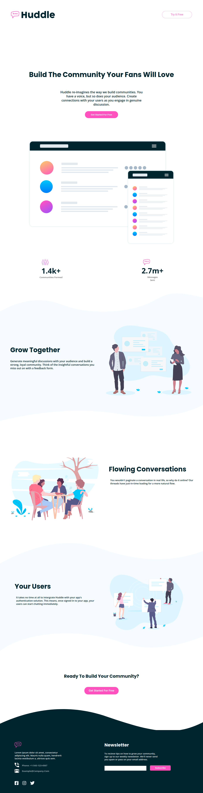

# Frontend Mentor - Huddle landing page with curved sections solution

This is a solution to the [Huddle landing page with curved sections challenge on Frontend Mentor](https://www.frontendmentor.io/challenges/huddle-landing-page-with-curved-sections-5ca5ecd01e82137ec91a50f2). Frontend Mentor challenges help you improve your coding skills by building realistic projects. 

## Table of contents

- [Overview](#overview)
  - [The challenge](#the-challenge)
  - [Screenshot](#screenshot)
  - [Links](#links)
- [My process](#my-process)
  - [Built with](#built-with)
  - [What I learned](#what-i-learned)
  - [Continued development](#continued-development)
  - [Useful resources](#useful-resources)
- [Author](#author)


## Overview

### The challenge

Users should be able to:

- View the optimal layout for the site depending on their device's screen size
- See hover states for all interactive elements on the page

### Screenshot




### Links

- Solution URL: [Github](https://github.com/julius-tamale/huddleLandingPageWithCurvedSections)
- Live Site URL: [Netlify](fmhuddle-landing-page.netlify.app)

## My process

### Built with

- Semantic HTML5 markup
- CSS custom properties
- Flexbox
- CSS Grid
- Mobile-first workflow

### What I learned

I used this project to learn how to push my code on github using the commandline. I can finally say am a git & github pro :)

```css
form input:nth-child(2) {
    width: 33%;
    padding: 5px;
    font-size: 15px;
    color: var(--very-pale-blue);
    background-color: var(--pink);
    border-radius: 7px;
    margin-top: 10px;
    font-weight: 600;
    position: absolute;
    right: 35px;
}

```


### Continued development

I struggled abit with CSS Grid so it is an area I should add re-visit and refresh my muscle memory.


### Useful resources

- [CSS Grid Layout](https://www.w3schools.com/css/css_grid.asp) - This helped me to refresh my muscle memory on CSS Grid. I really liked this pattern and will use it going forward.

## Author

- Website - [Julius Tamale](https://julius-tamale.netlify.app)
- Frontend Mentor - [@julius-tamale](https://www.frontendmentor.io/profile/yourusername)
- Twitter - [@tjewlius](https://www.twitter.com/tjewlius)